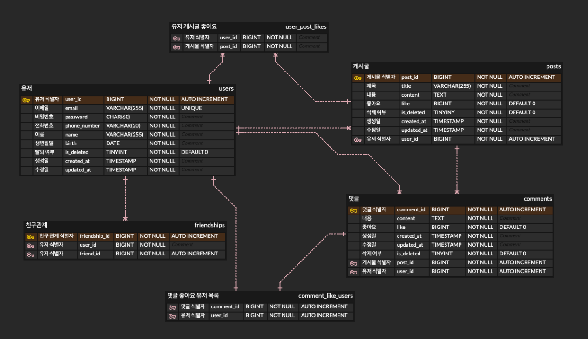

# 뉴스피드 API 
___  

## 프로젝트 소개  
___
Spring MVC, JPA, Cookie/Session, Filter를 학습하고 교육적인 목적에서 진행한 프로젝트입니다.  
인스타그램같은 SNS 애플리케이션의 API 서버를 구축하며,  
사용자 인증 처리부터 게시글·댓글·팔로우에 관한 핵심 기능을 구현하였습니다. 
> **내일배움캠프 5조**  
> **개발기간 : 2025.05.27 ~ 2025.06.03 (약 1주일)**

## 기술 스택
___

    
    
    
    

## ERD
___  

## API 문서
___
API 명세는 [Swagger API 문서] ()를 클릭해주세요.

## 개발팀 소개
___
|                                          고동원                                          |                                          이동근                                           |                                          기명현                                           | 이효선 |  
|:-------------------------------------------------------------------------------------:|:--------------------------------------------------------------------------------------:|:--------------------------------------------------------------------------------------:|:---:|
|  |  |  ||
|                          [@ko-dongwon](https://github.com/ko-dongwon)                          |                          [@DG0702](https://github.com/DG0702)                          |                          [@Gi0000](https://github.com/Gi0000)                          |[@hohohosn](https://github.com/hohohosn)|

## 주요 기능
___
### 프로필 관리
- 프로필 조회: 민감 정보 제외
- 프로필 수정: 본인만 가능
- 비밀번호 변경: 현재 비밀번호 확인 → 형식 및 기존 비밀번호 중복 검사 → 업데이트
### 뉴스피드 게시물 관리
- 게시글 CRUD: 작성자만 수정·삭제 가능 (권한 체크)
- 피드 조회: 생성일자 내림차순, 페이지당 10건 페이징 처리
### 사용자 인증
- 회원가입: 이메일 형식 아이디, Bcrypt 암호화, 비밀번호 복합성·최소 길이 검증
- 로그인/로그아웃: 세션 기반 인증
- 회원탈퇴: 비밀번호 확인 후 soft delete, 탈퇴 계정 재사용 불가
### 친구 관리
- 팔로우/언팔로우 기능
- 팔로우한 사람 게시물 최신순 피드 제공